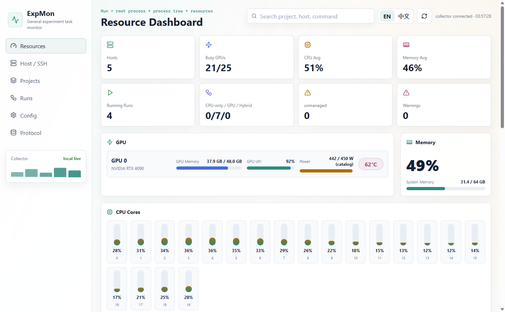
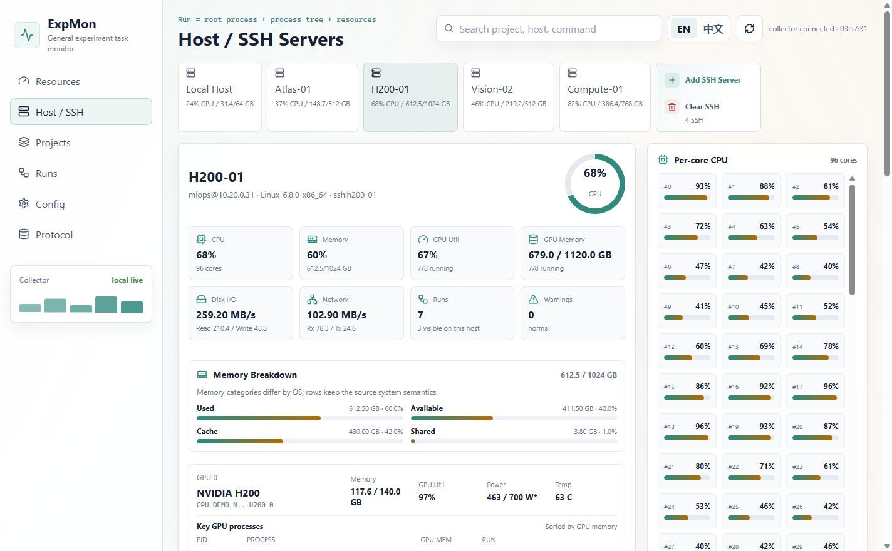
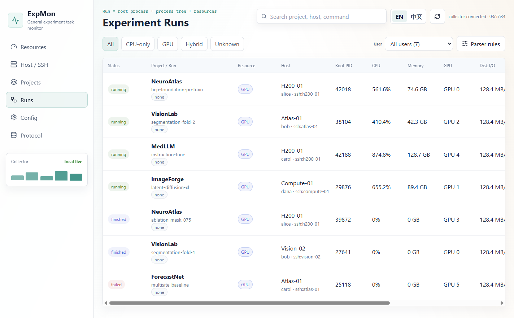

# ExpMon

**One desktop app for experiments, GPUs, and SSH servers.**

[中文文档](README_zh.md)


ExpMon gives research teams one local-first view of training processes, GPU servers, metrics, logs, and failures. Add an SSH host once; ExpMon installs and tunnels its lightweight agent automatically, then merges remote resources and runs into the same desktop UI.



_Screenshots use privacy-safe demo data and can be regenerated with `npm run screenshots:readme`._

## Why ExpMon

- **See the whole fleet:** CPU, memory, every GPU, per-core load, power, temperature, I/O, and active processes across local and SSH hosts.
- **Understand the experiment:** a run is its root process, process tree, resources, metrics, logs, events, hyperparameters, and Git project, not just a PID.
- **Find runs you did not launch:** automatic discovery and `adopt` bring existing training processes into Projects and Runs without restarting them.
- **Keep control local:** credentials and monitoring data stay on your machine; remote agents bind to loopback and are reached through SSH tunnels.
- **Use the logs you already have:** TensorBoard loss scalars, JSONL, CSV, W&B offline runs, and MLflow directories appear alongside resource history.

## Product Tour

### One view for every SSH host

Compare hosts at a glance, then inspect CPU cores, memory categories, GPUs, and attributed GPU processes on a single server.



### Runs organized by project and user

Filter work by user and resource type, distinguish running, finished, and failed experiments, and open any row for its process tree, curves, metrics, events, and logs.



## Get Started

### Windows desktop client

From a source checkout:

```powershell
npm ci
python -m pip install -r requirements.txt
npm run desktop:start
```

Build the standalone Python sidecar and Windows installer:

```powershell
npm run desktop:dist
```

The installer is written to `release-client/ExpMon-Setup-<version>-x64.exe`. Installed builds bundle the React UI and Python collector, choose a free loopback port, authenticate local API requests with a per-launch token, and clean up the collector process tree on exit. Users do not need a separate Python or Node.js installation.

Desktop configuration, SSH profiles, run metadata, managed runs, and collector logs live in Electron's ExpMon user-data directory.

### Browser development mode

Start the collector and Vite frontend together:

```powershell
npm run start:local
```

Open `http://127.0.0.1:5173`. Custom ports and a local config can be supplied with:

```powershell
powershell -ExecutionPolicy Bypass -File .\scripts\start-expmon.ps1 -CollectorPort 5185 -FrontendPort 5174 -Config .\expmon-local.yaml
```

Copy `.env.example` to `.env` for local environment overrides. Both files containing local state and generated desktop artifacts are ignored by Git.

## Managed Runs

Launch an experiment through ExpMon:

```powershell
python .\scripts\expmon.py launch --project demo --name train-resnet --resource-type gpu -- `
  python train.py --epochs 10
```

Log metrics from a launched process:

```powershell
python .\scripts\expmon.py log --step 100 train/loss=0.83 val/auc=0.91 objective=0.91
```

Or print metric markers from the training script:

```python
print("EXPMON_METRIC step=100 train/loss=0.83 val/auc=0.91 objective=0.91")
```

Log events from a launched process:

```powershell
python .\scripts\expmon.py event --type checkpoint --severity info --message "saved epoch 3"
```

Or print event markers:

```python
print('EXPMON_EVENT {"type":"cuda_oom","severity":"error","message":"CUDA out of memory"}')
```

The collector writes resource samples to `resources.jsonl` and events to `events.jsonl`, so finished managed runs can still show historical resource curves and detected failures.

## Experiment Log Visualization

The run detail page scans managed run directories for:

- TensorBoard event files
- Weights & Biases offline run directories
- MLflow tracking directories
- metric JSONL files
- metric CSV files

JSONL, CSV, and W&B summaries can be previewed inline. ExpMon incrementally imports TensorBoard `train_loss`, `valid_loss`/`val_loss`, and `test_loss` scalars into `metrics.jsonl`, including history that already exists when a process is adopted. TensorBoard is installed with the collector requirements; MLflow remains optional for opening its local viewer.

```powershell
pip install mlflow
```

## Configuration

`expmon.yaml` is the generic sample configuration committed to the repository. Use the **Config** page to edit the active local collector configuration: host id, refresh interval, experiment roots, managed run scan roots, command keyword rules, and explicit parser rules.

When `EXPMON_CONFIG` is not set, UI edits are saved to `expmon-local.yaml`, which is ignored by Git. When `EXPMON_CONFIG` is set, edits are saved to that local path. The collector applies saved changes without a restart.

Useful environment variables:

- `VITE_COLLECTOR_URL`: frontend API endpoint for the collector.
- `EXPMON_COLLECTOR_PORT`: port used by `scripts/local_collector.py`.
- `EXPMON_CONFIG`: local collector config path.
- `EXPMON_SSH_SERVERS`: local SSH server profile storage path.
- `EXPMON_RUN_METADATA`: local run notes and marks storage path.

## Host / SSH

The **Host / SSH** page shows local host resources and stores remote SSH server profiles in a gitignored local file. Key-based SSH profiles can be tested from the UI with the local `ssh` command.

For stable remote monitoring on Windows, macOS, or Ubuntu, run the lightweight remote agent on the target machine:

```powershell
python scripts/remote_agent.py --host 127.0.0.1 --port 5194
```

The local collector prefers the remote agent through an SSH tunnel before falling back to one-shot SSH sampling:

1. Run `expmon discover --json` over SSH or read the standard discovery manifest.
2. On a first Linux/macOS connection with no ExpMon installation, install the lightweight agent under `~/.local/share/expmon`; install missing `psutil` and TensorBoard support in the user environment first and fall back to an isolated venv when needed.
3. Bind the agent to remote `127.0.0.1:5194`, open an SSH tunnel, and sample through the tunnel.
4. Only when installation or tunneling is unavailable, try an explicitly exposed agent and one-shot SSH sampling.

After a new SSH profile passes its connection test, bootstrap starts in the background. Existing profiles are also installed on their first resource sample. Installation and startup are enabled by default; set `EXPMON_REMOTE_AGENT_AUTO_INSTALL=0` or `EXPMON_REMOTE_AGENT_AUTOSTART=0` to disable them. A failed installation enters a retry cooldown and falls back without blocking other hosts. The agent publishes remote managed, adopted, and automatically discovered runs into the local **Runs** and **Projects** pages.

To register a remote process that is already running, execute `adopt` on that remote host:

```bash
python scripts/expmon.py adopt --pid 3637117 --project NeuroSTORM \
  --name hcp1200-h200-gpu0 --resource-type gpu --log-file nohup.out
```

When the recorded root process exits, the collector persists `finished` and `ended_at` to both the manifest and `status.json`. Because an adopted process is not a child of ExpMon, its historical exit code is represented honestly as `exit_code: null` with `exit_code_known: false`; `expmon launch` continues to record the real exit code.

This means the recommended agent bind address is `127.0.0.1`; the remote host does not need to expose an HTTP port. Use `EXPMON_REMOTE_AGENT_PORT` on the local collector if you intentionally expose a different direct-agent port. For shared environments, set `EXPMON_AGENT_TOKEN` on the remote agent and the same value as `EXPMON_REMOTE_AGENT_TOKEN` on the local collector.

Password SSH profiles are saved locally as requested, but non-interactive connection testing and one-shot SSH snapshots require `sshpass` or switching the profile to key-based authentication.

## Project Workspace

The **Projects** page groups runs by their Git root or working directory. For Git repositories, it can show recent log entries, changed files, diff statistics, inline diffs, select files, generate or edit a commit message, create a commit, and run `git pull --ff-only` or `git push` through the local collector.

## Testing

Run a production build check:

```powershell
npm run build
```

Run the server-independent release checks:

```powershell
npm run check:release
```

`npm test` runs the same release checks. The GitHub Actions workflow uses this release-check path on pushes and pull requests.

With the frontend running, run the lightweight smoke test:

```powershell
npm run test:smoke
```

Run the broader UI regression checks for language switching, run detail navigation, resource subcharts, log filtering, and confirmation dialogs:

```powershell
npm run test:ui
```

Run collector-side checks for project root detection:

```powershell
npm run test:collector
```

Run the privacy scan before publishing or committing generated fixtures:

```powershell
npm run test:privacy
```

Regenerate the README's privacy-safe Electron screenshots:

```powershell
npm run screenshots:readme
```

Set `EXPMON_FRONTEND_URL` when the frontend is served on a custom port.

## Run Notes And Diagnostics

The run detail page supports local notes, marks, and pinned runs. These are stored in `expmon-run-metadata.json`, which is ignored by Git.

The collector also reports diagnostic insights for common problems such as error events, idle GPU allocations, CPU-side bottlenecks, and Jupyter/ipykernel processes holding GPU memory outside an ExpMon run.
